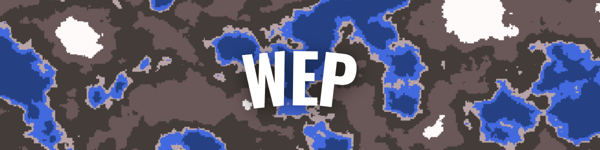
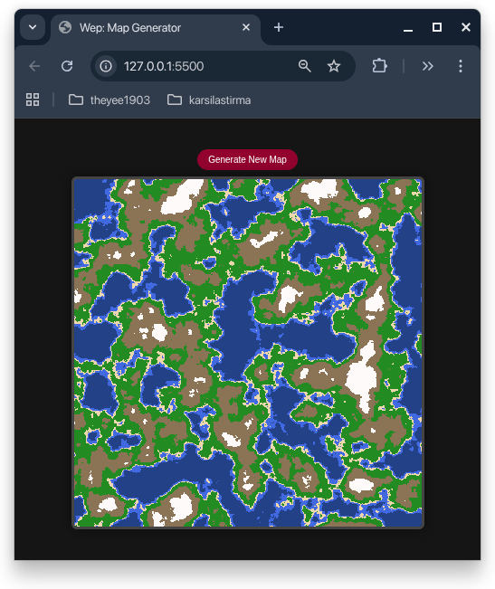

# Wep

A map generator web application built with HTML, CSS, and JavaSript.

---

## Features ✨

- Fast generation of maps
- Realistic terrain rendering
- Pixel art style

---

## Installation 

```bash
git clone https://github.com/YusufErdemK/wep.git
cd wep
```
Then open the `index.html` file in your web browser.

---


## Usage

1. Open the `index.html` file in your web browser.
2. Press `Generate New Map` button to create a new map.


## Screenshot


## License

MIT License - see LICENSE file for details

---

## Author
Developed by erdamn (Yusuf Erdem Kaymak)

## Social Medias

[](https://github.com/YusufErdemK)&nbsp;&nbsp;
[](https://www.instagram.com/theyee1903/)